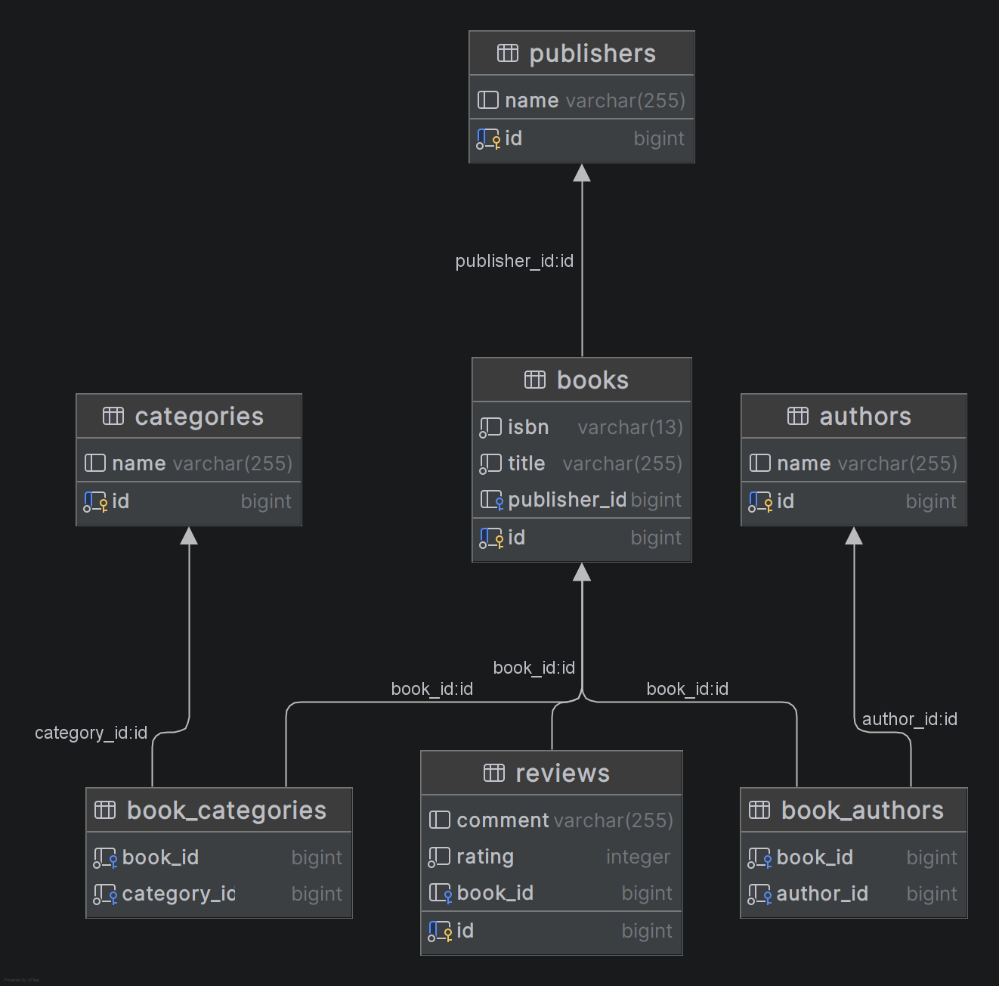

# 📚 Library Management System - Microservices Architecture

## 1. Descrierea Proiectului
Acesta este un sistem modern și distribuit pentru managementul unei biblioteci, construit pe o arhitectură bazată pe microservicii folosind Spring Boot și Spring Cloud. Proiectul acoperă întregul flux de gestiune a cărților, utilizatorilor și împrumuturilor, având securitate distribuită, configurare centralizată și caching de înaltă performanță.

Aplicația demonstrează concepte avansate de scalabilitate, toleranță la erori (Circuit Breaker) și inter-operabilitate (Feign).

## 2. Arhitectura Sistemului
Aplicația a fost separată în microservicii independente pentru a asigura scalabilitatea și separarea responsabilităților:

### Infrastructure Services
* **API Gateway (`port: 8080`):** Punctul unic de intrare în sistem. Rutează dinamic request-urile și integrează Spring Cloud LoadBalancer.
* **Discovery Server (`port: 8761`):** Serviciul de Service Registry bazat pe Netflix Eureka. Permite descoperirea automată a serviciilor.
* **Config Server (`port: 8888`):** Centralizează configurațiile pentru toate microserviciile.

### Business Services
* **User Service:** Gestionează entitățile de utilizator, rolurile (ADMIN / USER) și emite token-urile JWT. Parola este securizată folosind `BCrypt`.
* **Catalog Service (`port: 8082`):** Gestionează cărțile, autorii, categoriile, editurile și recenziile. Interogările de citire sunt optimizate folosind **Redis Cache**.
* **Lending Service:** Gestionează logica de business pentru împrumuturi și comunică inter-servicii cu User și Catalog Service.

### Baze de Date & Caching
* **PostgreSQL:** Baza de date relațională principală rulată în container Docker.
* **Redis:** Caching layer de înaltă performanță pentru entitățile accesate frecvent (NoSQL).

---

## 3. Modelul de Date (ER Diagram)
Sistemul respectă cu strictețe cerința de modelare a datelor având relații complexe între entități:
* `@OneToOne` / `@ManyToOne`: Legătura dintre Carte și Editură (`Publisher`), Carte și Recenzii (`Review`).
* `@ManyToMany`: Legătura dintre Cărți și Autori (`Author`), Cărți și Categorii (`Category`).

---
## 4. Instrucțiuni de Instalare și Rulare
### 1. Start Infrastructure
   Rulați docker-compose pentru a porni PostgreSQL și Redis:

Bash
docker-compose up -d
### 2. Boot Up Microservices
   Ordinea de pornire:

* **Config Server (ConfigServerApplication)**
* **Discovery Server (DiscoveryServerApplication)**
* **User Service**
* **Catalog Service**
* **Lending Service**
* **API Gateway**

### 3. Accesul la Aplicație
* Main Portal (UI): http://localhost:8080/

* Eureka Dashboard: http://localhost:8761/

* Credentiale Default: admin / password

🛡️ Securitate & API
* UI: Spring Security cu form-login.
* M2M (Microservices): Lending Service utilizează FeignAuthInterceptor pentru a genera temporar JWT-uri interne securizate.
